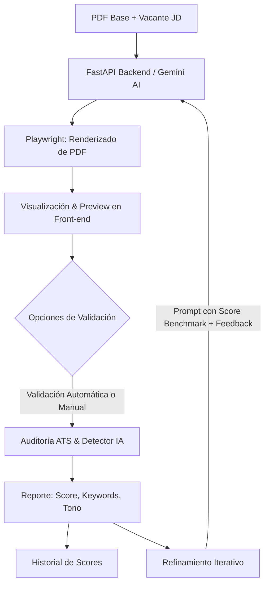

# 🚀 Resume Tailor AI (v2) — ATS Match & Iterative Optimizer

<div align="center">

[](https://reactjs.org/)
[](https://fastapi.tiangolo.com/)
[](https://aistudio.google.com/)
[](https://playwright.dev/)
[]()

**Genera, audita y optimiza iterativamente tu currículum contra cualquier vacante laboral (Job Description) superando filtros ATS y detectores de IA.**

[Características](#-características-principales) • [Arquitectura](#-arquitectura-y-flujo) • [Instalación](#-guía-de-instalación) • [Historial de Mejoras](#-historial-de-versiones-v2) • [Agradecimientos](#-agradecimientos)

</div>

---

## 🌟 ¿Qué es Resume Tailor AI v2?

**Resume Tailor AI v2** es una solución Full-Stack moderna diseñada para maximizar la tasa de éxito de postulaciones laborales. No solo adapta la experiencia y habilidades de tu currículum existente (PDF) a los requisitos específicos de una oferta de empleo, sino que introduce un **ciclo de auditoría y refinamiento continuo** con métricas ATS reales, detección de contenido sintético/IA y control de evolución de versiones.

---

## ⚡ Características Principales

### 1. 🎯 Generación Adaptada de Alto Impacto
- **Extracción Inteligente:** Procesa currículums en formato PDF respetando tu trayectoria base.
- **Inyección de Contexto Personalizado:** Posibilidad de suministrar Rol Objetivo, enlaces a GitHub, LinkedIn y notas clave.
- **Renderizado Nativo con Playwright:** Exporta un documento PDF impecable, tipográficamente balanceado y 100% legible para escáneres ATS.

### 2. 📊 Auditoría Integral ATS & Detección de IA
- **Score ATS (Compatibilidad CompuTrabajo, Workday, etc.):** Evaluación de coincidencia de palabras clave, balance técnico/blando y formato estructural.
- **Detector de Tono IA:** Análisis probabilístico para detectar patrones repetitivos, sobreuso de frases trilladas de LLMs y sugerencias para humanizar el perfil.
- **Diagnóstico Detallado:**
  - Desglose de competencias encontradas vs. faltantes.
  - Consejos de redacción orientados a resultados cuantificables (fórmula STAR/Google XYZ).
  - Recomendaciones de ascenso de rango (Mid $\rightarrow$ Senior / Lead).

### 3. 🔄 Refinamiento Iterativo Inteligente
- **Iteración sobre el CV Generado:** El sistema no reinicia desde cero; utiliza como base el último PDF generado (`base_resume_filename`) para pulirlo sin perder los ajustes previos.
- **Inyección Selectiva de Feedback:**
  - Checkbox para incluir consejos de humanización de tono.
  - Checkbox para incorporar recomendaciones de nivel senior.
  - Caja de texto para instrucciones personalizadas adicionales.
- **Protección contra Regresión de Score:** Inyecta automáticamente el puntaje actual y un objetivo a superar en el prompt para asegurar que cada regeneración mantenga o supere la calidad.

### 4. 📈 Historial y Evolución de Scores
- Línea temporal visual que compara el desempeño entre versiones (`v1`, `v2`, etc.).
- Identificación inmediata de mejoras o retrocesos porcentuales (+15% ▲ / -5% ▼).

### 5. 🔍 Botón "Solo Auditar ATS"
- ¿Ya tienes un CV listo y solo quieres saber cómo rankea frente a una oferta?
- Audita directamente tu archivo PDF sin necesidad de generar una nueva versión ni gastar tokens innecesarios.

---

## 🏗️ Arquitectura y Flujo



---

## 🛠️ Guía de Instalación y Uso

### Prerrequisitos
- [Node.js](https://nodejs.org/) (v18+)
- [Python 3.10+](https://www.python.org/)
- API Key gratuita de [Google AI Studio](https://aistudio.google.com/app/apikey)

---

### 1. Backend (FastAPI + Playwright)

1. Ingresa a la carpeta del backend:
   ```bash
   cd backend
   ```

2. Crea y activa tu entorno virtual:
   - **Windows:**
     ```bash
     python -m venv venv
     .\venv\Scripts\activate
     ```
   - **Linux / macOS:**
     ```bash
     python3 -m venv venv
     source venv/bin/activate
     ```

3. Instala las dependencias y el navegador de Playwright:
   ```bash
   pip install -r requirements.txt
   playwright install chromium
   ```

4. Configura tu variable de entorno en `backend/.env`:
   ```env
   GEMINI_API_KEY=tu_api_key_aqui
   ```

5. Inicia el servidor de backend:
   ```bash
   uvicorn main:app --reload --host 0.0.0.0 --port 8000
   ```

---

### 2. Frontend (React + Vite + Tailwind CSS)

1. Abre una segunda terminal e ingresa a la carpeta de frontend:
   ```bash
   cd frontend
   ```

2. Instala los paquetes:
   ```bash
   npm install
   ```

3. Inicia la aplicación en modo desarrollo:
   ```bash
   npm run dev
   ```

4. Abre tu navegador en `http://localhost:5173`.

---

## 📂 Estructura del Proyecto

```text
jd-to-resume/
├── backend/
│   ├── main.py               # Endpoints FastAPI: generación, auditoría ATS y streaming
│   ├── knowledge_base.txt    # Contexto técnico de soporte para la IA
│   ├── requirements.txt      # Librerías de Python
│   └── output/               # PDFs generados (almacenamiento temporal)
├── frontend/
│   ├── src/
│   │   ├── ToolApp.tsx       # Interfaz principal, estado, historial y controles ATS
│   │   ├── App.tsx           # Router / Wrapper principal
│   │   └── index.css         # Estilos globales y tokens Neo-Brutalist
│   └── package.json          # Dependencias de npm
├── sample-pdfs/              # Plantillas de ejemplo para pruebas
└── README.md
```

---

## 🚀 Historial de Versiones (v2.0)

- [x] **Auditoría ATS Completa:** Algoritmo de compatibilidad de palabras clave y estructura.
- [x] **Estimador de Tono IA:** Detección de frases cliché y sugerencias de redacción orgánica.
- [x] **Panel de Refinamiento Modular:** Checkboxes de feedback automático y campo libre de instrucciones.
- [x] **Memoria de Versión Previa:** Las regeneraciones toman como base el PDF generado (`base_resume_filename`), no el CV inicial plano.
- [x] **Control de Regresión:** El prompt incluye el puntaje actual y fija un target mínimo a superar.
- [x] **Historial Visual de Score:** Comparativa porcentual entre iteraciones.
- [x] **Botón Standalone "Solo Auditar ATS":** Análisis independiente sin coste de generación.

---

## 🤝 Agradecimientos y Reconocimientos

Este proyecto fue construido y extendido a partir de la idea y base inicial de **[VJsharan/jd-to-resume](https://github.com/VJsharan/jd-to-resume)**. 

Queremos expresar un sincero agradecimiento a su creador original por sentar las bases conceptuales y la integración de Playwright + Jinja para la generación ágil de plantillas en PDF. Esta versión **v2** expande la propuesta original incorporando auditoría ATS en tiempo real, detección de lenguaje IA, ciclo de optimización iterativo y control evolutivo de puntaje.

---

<div align="center">
  Hecho con dedicación para potenciar postulaciones laborales de alto impacto. ⭐ ¡Si te sirvió el proyecto, no olvides dejar tu estrella!
</div>
