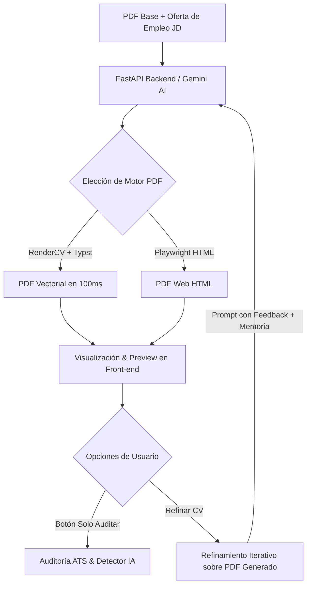

# 🚀 Resume Tailor AI (v2.5) — ATS Match, RenderCV (Typst) & Iterative Optimizer

<div align="center">

[](https://reactjs.org/)
[](https://fastapi.tiangolo.com/)
[](https://github.com/sinaatalay/rendercv)
[](https://aistudio.google.com/)
[]()

**Genera, audita, diseña y optimiza iterativamente tu currículum contra cualquier oferta laboral (Job Description) superando filtros ATS y detectores de IA con plantillas vectoriales profesionales.**

[Características](#-características-principales) • [Diseños & Plantillas](#-diseños-y-plantillas-pdf) • [Arquitectura](#-arquitectura-y-flujo) • [Instalación](#-guía-de-instalación) • [Agradecimientos](#-agradecimientos-y-créditos)

</div>

---

## 🌟 ¿Qué es Resume Tailor AI v2.5?

**Resume Tailor AI v2.5** es una plataforma Full-Stack avanzada diseñada para elevar el impacto de tus postulaciones laborales. No solo adapta la experiencia de tu CV en formato PDF a los requisitos de una oferta de trabajo, sino que ofrece:
- **Compilador tipográfico ultra rápido con Typst + RenderCV.**
- **Selección de plantillas profesionales creadas para superar filtros ATS.**
- **Auditoría independiente ATS & Detección de tono de IA.**
- **Ciclo de refinamiento iterativo sobre el CV generado sin pérdida de datos.**
- **Detección y traducción de idioma automática (Español / Inglés).**

---

## ⚡ Características Principales

### 1. 🎨 Renderizado Vectorial de Alta Calidad & Plantillas ATS
Con el motor integrado de **RenderCV + Typst**, los currículums se compilan en milisegundos generando archivos PDF vectoriales ultra nítidos y sin distorsiones tipográficas:
- 🟢 **SB2Nov:** El formato estándar preferido en Silicon Valley y empresas Tech.
- 🔵 **Classic:** Diseño sobrio, tradicional y elegante ideal para cualquier sector.
- 🟣 **ModernCV:** Formato contemporáneo con detalles sutiles a color.
- ⚪ **Classic HTML:** Opción de renderizado web mediante Playwright.

### 2. 🎯 Adaptación y Restructuración Sin Alucinación
- **Cero Invención de Datos:** La IA únicamente reestructura, reordena y enfatiza tu experiencia real existente en el CV base.
- **Traducción e Idioma Automático:** Detecta el idioma de la oferta de trabajo y genera todo el contenido (resumen, viñetas y títulos de sección) en el mismo idioma de la vacante.
- **Verbos de Acción y Métricas Cuantitativas:** Redacción orientada a resultados concretos (fórmula STAR) e integración natural de palabras clave exactas.

### 3. 📊 Auditoría Integral ATS & Detector de Tono IA
- **Score ATS (% Match):** Análisis de coincidencia de competencias técnicas y blandas frente a plataformas como CompuTrabajo, Workday, LinkedIn y Greenhouse.
- **Detección de Tono Sintético / IA:** Identifica si la redacción suena robótica o cargada de clichés de LLMs, sugiriendo cambios para humanizar el perfil.
- **Botón "Solo Auditar ATS":** Audita directamente tu archivo PDF sin necesidad de generar una nueva versión ni consumir tokens de edición.

### 4. 🔄 Refinamiento Iterativo y Memoria de Versiones
- **Refinación sobre el PDF Generado:** Al solicitar correcciones, el backend toma como base el último PDF generado (`base_resume_filename`), preservando las mejoras acumuladas.
- **Historial Evolutivo de Puntaje:** Compara visualmente el avance del Score ATS y la reducción de tono IA a lo largo de cada iteración (`v1`, `v2`, etc.).

---

## 📐 Diseños y Plantillas PDF (RenderCV + Typst)

| Plantilla | Estilo | Indicado Para |
| :--- | :--- | :--- |
| **SB2Nov** | Limpio, estructurado y de una sola columna | Desarrolladores, Data Science, DevOps y Tech |
| **Classic** | Tradicional, sobrio y elegante | Administración, Finanzas, Salud, Leyes y Gerencia |
| **ModernCV** | Moderno con acentos visuales sutiles | Marketing, Diseño, Producto y Ventas |
| **Classic HTML** | Renderizado web flexible (Playwright) | Pruebas y personalización HTML |

---

## 🏗️ Arquitectura del Sistema



---

## 🛠️ Guía de Instalación y Uso

### Prerrequisitos
- [Node.js](https://nodejs.org/) (v18+)
- [Python 3.10+](https://www.python.org/)
- Clave API gratuita de [Google AI Studio](https://aistudio.google.com/app/apikey) o proveedor OpenAI compatible.

---

### 1. Backend (FastAPI + RenderCV / Typst)

1. Ingresa a la carpeta del backend:
   ```bash
   cd backend
   ```

2. Crea y activa tu entorno virtual:
   - **Windows:**
     ```powershell
     python -m venv venv
     .\venv\Scripts\activate
     ```
   - **Linux / macOS:**
     ```bash
     python3 -m venv venv
     source venv/bin/activate
     ```

3. Instala las dependencias necesarias:
   ```bash
   pip install -r requirements.txt
   playwright install chromium
   ```

4. Configura tu variable de entorno en `backend/.env`:
   ```env
   GEMINI_API_KEY=tu_api_key_aqui
   ```

5. Inicia el servidor de backend:
   ```bash
   uvicorn main:app --reload --host 0.0.0.0 --port 8000
   ```

---

### 2. Frontend (React + Vite + Tailwind CSS)

1. En una segunda terminal, ingresa a la carpeta de frontend:
   ```bash
   cd frontend
   ```

2. Instala los paquetes de Node:
   ```bash
   npm install
   ```

3. Inicia la aplicación web:
   ```bash
   npm run dev
   ```

4. Abre tu navegador en `http://localhost:5173`.

---

## 📂 Estructura del Proyecto

```text
jd-to-resume/
├── backend/
│   ├── main.py               # Endpoints FastAPI y pipeline de generación/auditoría
│   ├── render_service.py     # Adaptador de datos y motor de renderizado RenderCV (Typst)
│   ├── requirements.txt      # Dependencias (FastAPI, RenderCV, Typst, PyMuPDF, etc.)
│   └── output/               # PDFs generados (almacenamiento persistente)
├── frontend/
│   ├── src/
│   │   ├── ToolApp.tsx       # UI interactiva: selección de plantillas, auditoría e historial
│   │   ├── App.tsx           # Contenedor principal de la aplicación
│   │   └── index.css         # Estilos globales y diseño Neo-Brutalist
│   └── package.json          # Configuración y scripts npm
└── README.md
```

---

## 🤝 Agradecimientos y Créditos

Este proyecto rinde reconocimiento y agradecimiento a las siguientes iniciativas de código abierto:

1. **[VJsharan/jd-to-resume](https://github.com/VJsharan/jd-to-resume):** Proyecto base original que sirvió como inspiración técnica e inicial para la integración de Jinja + Playwright en la generación de currículums.
2. **[Sina Atalay / RenderCV](https://github.com/sinaatalay/rendercv):** Framework open-source extraordinario de generación de CVs en YAML/Typst que proporciona la estructura base de plantillas y modelos de datos tipográficos.
3. **[Typst Project](https://github.com/typst/typst):** Motor de marcado y compilación tipográfica moderno que permite generar PDFs vectoriales nítidos a máxima velocidad.

---

<div align="center">
  Creado para potenciar postulaciones de alto impacto. ⭐ ¡Si este proyecto te ha sido útil, no olvides dejar tu estrella en el repositorio!
</div>
